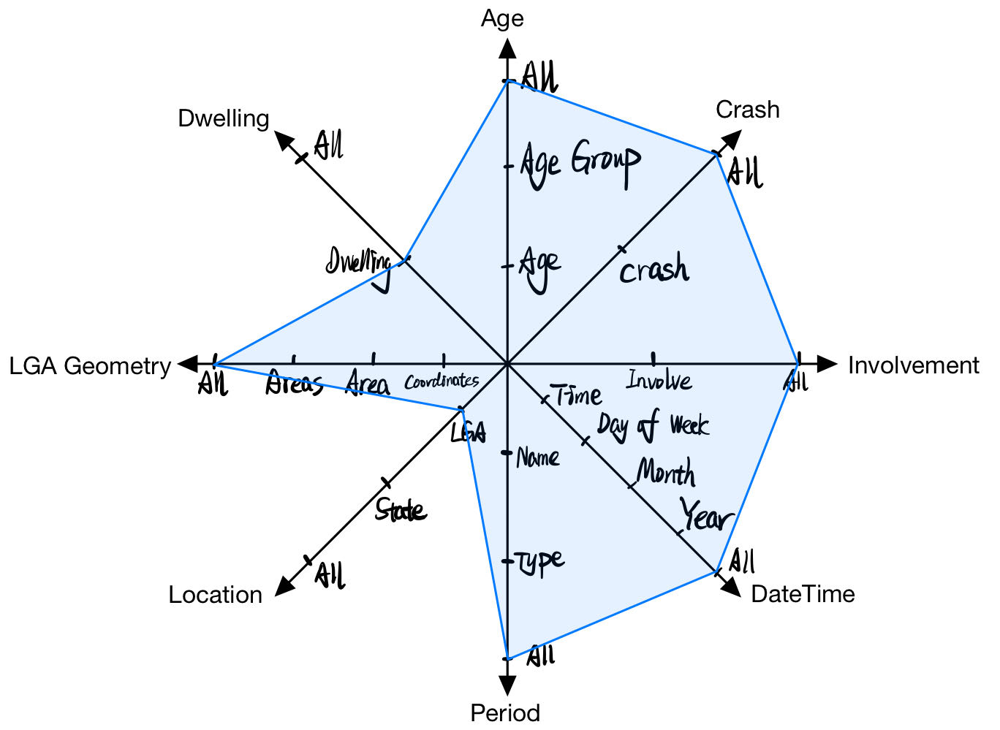

# CITS4401 Data Warehouse Project 1

**Presented by:**

24141207	Kaichao Zheng

---

This project is now public on [GitHub](https://github.com/Kaichao-Zheng/CITS5504-Data-Warehousing).

* The `.geojson`, `.json`, and `.pbix` files involved are too large to be attached into `.zip` submission.

Use the following code to view the full project:

```bash
git clone https://github.com/Kaichao-Zheng/CITS5504-Data-Warehousing.git
```

---

## Dimension Design

### 1. The grain of fact table

Each row represents a **fatality** in a specific crash.

### 2. The snowflake schema


#### 2.1 Fact table and dimension tables

**Fatality** (PK:`Fatality ID`, `Gender`, `Road User`, `National Remoteness Areas`, `SA4 Name 2021`, FK:`Age`, FK:`Crash ID`, FK:`Involve ID`, FK:`Date ID`, FK:`Period Name`, FK:`LGA Name`,)

* **Age** (PK: `Age`, `Age Group`)
* **Crash** (PK:`Crash ID`, `Crash Type`, `Speed Limit`, `National Road Type`)
* **Involvement** (PK:`Involve ID`, `Bus`, `Heavy Rigid Truck`, `Acticulated Truck`)
* **DateTime** (PK:`Date ID`, `Month`, `Year`, `Day of Week`, `Time`)
* **Period** (PK:`Period Name`, `Period Type`)
* **Location** (PK&FK:`LGA Name`, `State`, FK:`LGA Code`)
  * **Dwelling** (PK:`LGA Name`, `Dwelling`)
  * **LGA_Geometry** (PK: `LGA Code`, `LGA Geometry`)

#### 2.2 Measures

##### In PostgreSQL

`count`: Each grain in fact table has a `count` measure, which always equals to 1, in order to facilitate later **roll-up** and **drill-down** in Power BI.

##### In Power BI

`crashCount`: Count the unique values in `Crash ID`.

`SUM`, `AVERAGE`, `MAX`, `MIN`

### 4. Typical Data Transformation

#### 4.1 Partial Dependency Removal (1NF to 2NF)

Add a foreign key `Involve ID` in **Fatality** to separate **Involvement dimension** from original fact table.

#### 4.2 Boolean Value Mapping

Convert `isChristmas` and `isEaster` into `Period Name:Christmas` and `Period Name:Easter`.

#### 4.3 Unification of `LGA Name` across different data

Manually analyze the `LGA Name` feature in `Fatilities.xlsx`, `Popolation.xlsx`, and `Dwelling.csv`.

* Create `nameDiff.xlsx` as a working spreadsheet.
* Use Excel function `SUBSTITUE()` to find unmatched names.
* Always choose **the longest name** as their final name.
* Export as `replaceDict.csv` for later import as dictionary and used as parameter in `pandas.dataframe.replace()`.

## Python-Based ETL Process

I mainly use `Pandas` and `GeoPandas` in Python as processing tools.

### 1. Data Cleansing

#### 1.1 Cleanse null value

```python
# Overview logic of NA cleansing
invalid = [-9,'-9','Unknown','Undetermined']
myDataFrame = myDataFrame.replace(invalid, pd.NA)
# Cleanse any row with NA
myDataFrame.dropna()
# Cleanse specified row with NA
myDataFrame.dropna(subset=['Specified Properties'])
```

#### 1.2 Ensure uniqueness of each row

```python
pandas.dataframe.drop_duplicates()
```

#### 1.2 Drop original properties in fact table

```python
# Overview logic of relevant code among different funcitons
toDrop = ['Day of week']
toDrop += ['Time of day']

global toDrop
toDrop += ['Age Group']																				# getDim_Age()
toDrop += ['Crash Type', 'Speed Limit', 'National Road Type']										# getDim_Crash()
toDrop += ['Bus Involvement','Heavy Rigid Truck Involvement','Articulated Truck Involvement']		# getDim_Involvement()
toDrop += ['Month','Year','Dayweek','Time']															# getDim_DateTime()
toDrop += ['Christmas Period','Easter Period']														# getDim_Period()
toDrop += ['State']																					# getDim_Location()
```

### 2. Data Preprocessing

#### 2.1 Use a external `replaceDict` to unify `LGA Name`

* Analyze `LGA Name` and create external `replaceDict.csv`.

  * Always choose **the longest name** as their final name.


  **Typical Cleansing**:

| Fatilities.xlsx                                    | Popularity.xlsx                       | Dwelling.csv                                       | original                              | replacement                           |
| -------------------------------------------------- | ------------------------------------- | -------------------------------------------------- | ------------------------------------- | ------------------------------------- |
| Anangu Pitjantjatjara Y<mark>u</mark>nkunytjatjara | Anangu Pitjantjatjara Yankunytjatjara | Anangu Pitjantjatjara Y<mark>u</mark>nkunytjatjara | Anangu Pitjantjatjara Yankunytjatjara | Anangu Pitjantjatjara Yunkunytjatjara |
| Armidale <mark>Regional</mark>                     | Armidale                              | Armidale <mark>Regional</mark>                     | Armidale                              | Armidale Regional                     |
| Bayside                                            | Bayside<mark> (NSW)</mark>            | Bayside<mark> (NSW)</mark>                         | Bayside                               | Bayside (NSW)                         |
| Break O<mark>'</mark>Day                           | Break O`Day                           | Break O<mark>'</mark>Day              |Break O`Day|Break O'Day|
| Greater Hume                                       | Greater Hume                          | Greater Hume <mark>Shire</mark>                    | Greater Hume                          | Greater Hume Shire                    |

* Unify `LGA Name` via external `replaceDict.csv`.

  ```python
  # Import replace dict
  rawDict = pd.read_csv("dict/replaceDict.csv")
  replace_dict = dict(zip(rawDict['original'], rawDict['replacement']))
  
  # getDim_Dwelling()
  dwell['LGA (EN)'] = dwell['LGA (EN)'].replace(replace_dict)
  
  # getDim_Location()
  location['National LGA Name 2021'] = location['National LGA Name 2021'].replace(replace_dict)
  fatality['National LGA Name 2021'] = fatality['National LGA Name 2021'].replace(replace_dict)
  population['Local Government Area'] = population['Local Government Area'].replace(replace_dict)
  ```

#### 2.2 Drill down `geometry` datatype in Power BI for map visualization

>Supposed I have imported the **LGA_Geometry Dimension** into **Power BI**.
>
>* There will be some automatic steps to extract `.json` source data.
>* I duplicate imported `Dim_LGA_Geometry` dimension and rename it as `Dim_Geometry_DrillDown` to differentiate them.
>* The expected location format in Power BI is `[longitute,latitude]`, rather than `[longitute,latitude]` in bridging `.json`.

##### Applied Operations in 'Transform data' window

* Remove redundant columns

* Get `longitute` , `latitute`, and reordered `Coordinate`

  * Expand `LGA Coordinates` **twice**

    >`geometry` datatype is a multiple dimension list, each represents as a polygon of real-world location:
    >
    >- Each polygon is made up of multiple areas.
    >- Each area is made up of coordinates.

  * Extract values from innermost list datatype to gain exact `LGA Coordinate`

  * Split columns by comma to get `longitute` and `latitute`

  * Merge and reorder `longitute` and `latitute` as a new column

* Rename columns for readability


## PostgreSQL Workflow

I use the ready-made lab docker image `dw_2025`.

### 1. Copy csv files into Docker container

Run following code in terminal to break Docker contain isolation.

* `pgdb` is the container name

```bash
docker cp "/path/to/local/folder/." pgdb:/tmp
```

### 2. Define database tables structures

```postgresql
-- Create dimension table for Age
CREATE TABLE Dim_Age (
    "Age"					VARCHAR(10) PRIMARY KEY,
    "Age Group"				VARCHAR(20)
);

-- Create dimension table for Crash
CREATE TABLE Dim_Crash (
    "Crash ID"				INTEGER PRIMARY KEY,
    "Crash Type"			VARCHAR(20),
	"Speed Limit"			VARCHAR(10),
	"National Road Type"	VARCHAR(50)
);

-- Create dimension table for Involvement
CREATE TABLE Dim_Involvement (
    "Involve ID"			VARCHAR(5) PRIMARY KEY,
    "Bus"					VARCHAR(10),
	"Heavy Rigid Truck"		VARCHAR(10),
	"Articulated Truck"		VARCHAR(10)
);

-- Create dimension table for DateTime
CREATE TABLE Dim_DateTime (
    "DateTime ID"			INTEGER PRIMARY KEY,
    "Month"					INTEGER,
	"Year"					INTEGER,
	"Day of Week"			VARCHAR(10),
	"Time"					VARCHAR(10)
);

-- Create dimension table for Period
CREATE TABLE Dim_Period (
    "Period Name"			VARCHAR(10) PRIMARY KEY,
    "Period Type"			VARCHAR(10)
);

-- Create dimension table for Dwelling
CREATE TABLE Dim_Dwelling (
    "LGA Name"				VARCHAR(50) PRIMARY KEY,
	"Dwelling"				VARCHAR(10)
);

-- -- Create dimension table for LGA_Geometry
-- CREATE TABLE Dim_LGA_Geometry (
--	"LGA Code"				VARCHAR(10) PRIMARY KEY,
--	"LGA Geometry"			GEOMETRY(MultiPolygon, 4326)	-- Placeholder datatype, doesn't work
-- );

-- Create dimension table for Location
CREATE TABLE Dim_Location (
    "LGA Code"				VARCHAR(10),
    "LGA Name"				VARCHAR(50) PRIMARY KEY,
	"State"					VARCHAR(10),
--	FOREIGN KEY ("LGA Code") REFERENCES Dim_LGA_Geometry("LGA Code"),
    FOREIGN KEY ("LGA Name") REFERENCES Dim_Dwelling("LGA Name")
);

-- Create fact table for fatality
CREATE TABLE Fact_Fatality (
    "Fatality ID"			INTEGER PRIMARY KEY,
    "Gender"				VARCHAR(10),
	"Age"					VARCHAR(10),
    "Road User"				VARCHAR(30),
    "Crash ID"				INTEGER,
    "Involve ID"			VARCHAR(5),
    "DateTime ID"			INTEGER,
    "Period Name"			VARCHAR(10),
    "LGA Name"				VARCHAR(50),
    "National Remoteness Areas" VARCHAR(30),
    "SA4 Name 2021"			VARCHAR(50),
    FOREIGN KEY ("Age") REFERENCES Dim_Age("Age"),
    FOREIGN KEY ("Crash ID") REFERENCES Dim_Crash("Crash ID"),
    FOREIGN KEY ("Involve ID") REFERENCES Dim_Involvement("Involve ID"),
    FOREIGN KEY ("DateTime ID") REFERENCES Dim_DateTime("DateTime ID"),
    FOREIGN KEY ("Period Name") REFERENCES Dim_Period("Period Name"),
    FOREIGN KEY ("LGA Name") REFERENCES Dim_Location("LGA Name")
);
```

```bash
CREATE TABLE

Query returned successfully in 107 msec.
```

### 3. Load data from the copied csv files

```postgresql
COPY Dim_Age FROM '/tmp/Dim_Age.csv' WITH (FORMAT csv, HEADER true);					-- Insert Age dimension data
COPY Dim_Crash FROM '/tmp/Dim_Crash.csv' WITH (FORMAT csv, HEADER true);				-- Insert Crash dimension data
COPY Dim_Involvement FROM '/tmp/Dim_Involvement.csv' WITH (FORMAT csv, HEADER true);	-- Insert Involvement dimension data
COPY Dim_DateTime FROM '/tmp/Dim_DateTime.csv' WITH (FORMAT csv, HEADER true);			-- Insert DateTime dimension data
COPY Dim_Period FROM '/tmp/Dim_Period.csv' WITH (FORMAT csv, HEADER true);				-- Insert Period dimension data
COPY Dim_Dwelling FROM '/tmp/Dim_Dwelling.csv' WITH (FORMAT csv, HEADER true);			-- Insert Dwelling dimension data
-- COPY Dim_LGA_Geometry FROM '/tmp/LGA_Geometry.json' WITH (FORMAT json, HEADER true);	-- Pseudo LGA_Geometry dimension data
COPY Dim_Location FROM '/tmp/Dim_Location.csv' WITH (FORMAT csv, HEADER true);			-- Insert Location dimension data
COPY Fact_Fatality FROM '/tmp/Fact_Fatality.csv' WITH (FORMAT csv, HEADER true);		-- Insert fatality fact table data
```

```bash
COPY 56874

Query returned successfully in 2 secs 175 msec.
```

## Power BI Visualization

I completed extra datatype transformation works in Power BI as preprocessing.

### 1. Link the coordinate dimension to the existing schema

> Loading `geometry` datatype into PostgreSQL is really tedious, so I turn to load the `.json` file into Power BI separately.

In Model View, use "Manage Relationships" to add a new relationship.

* This relationship enables automatic filtering across different visuals in Power BI.


### 2. Business queries

The process of queries involves creating <u>temporary measures</u>, shown as underlined.

---

#### Query 1	Which LGA did the crash involving the oldest driver happened in?

> **Table Visual**
>
> * **fact_fatality**
>
>   `age`: Filter top 1 of <u>Max of Age</u>
>
>   `count`: <u>Sum of count</u>
>
>   `Road User`: Driver
>
>   `Crash ID`
>
> * **dim_location**
>
>   `LGA Code`
>
>   `LGA Name`: not blank

> **Map Visual**
>
> * **dim_lga_geometry_drilldown**
>
>   `LGA Name`: as Location
>
>   `Coordinate`: as Legend

> **Final Step**
>
> Simply click the filtered data "Waverley" in table visual, 
>
> the map visual will automatically zoom into the related area.

> **The Screenshot**
>
> 

> **The StarNet Diagram**
>
> 

#### Query 2	Which day of week has the most bus-involved fatalities in Western Australia?

> * **fact_fatality**
>
>   `count`: <u>Sum of count</u>
>
> * **dim_involvement**
>
>   `Bug`: is "Yes"
>
> * **dim_datetime**
>
>   `Day of Week`
>
>   `WeekSort`: <u>Helper Field for sort</u>
>
> * **dim_location**
>
>   `State`: is "WA"

> **The Screenshot**
>
> 

> **The StarNet Diagram**
>
> 

#### Query 3	What was the trend of total fatalities in Western Australia in past years?

>* **fact_fatality**
>
>  `count`: <u>Sum of count</u>
>
>* **dim_location**
>
>  `State`: is "WA"
>
>* **dim_datetime**
>
>  `Year`
>

> **The Screenshot**
>
> 

> **The StarNet Diagram**
>
> 

#### Query 4	What is the ratio of fatalities during Christmas and Easter periods?

> * **fact_fatality**
>
>   `count`: <u>Sum of count</u>
>
> * **dim_period**
>
>   `Period Name`: is "Christmas" or "Easter"

> **The Screenshot**
>
> 

> **The StarNet Diagram**
>
> 

#### Query 5	What is the dwelling in Adelaide areas?

> **Table and Column Chart**
>
> * **dim_location**
>
>   `LGA Code`
>
>   `LGA Name`: contains "Adelaide"
>
> * **dim_dwelling**
>
>   `Dwelling`

> **Map Visual**
>
> * **dim_lga_geometry_drilldown**
>
>   `LGA Name`: as Location
>
>   `Coordinate`: as Legend

> **The Screenshot**
>
> The number of coordinates is limited
> * A half of "Adelaide Plains" is not visualized.
> * "Port Adelaide Enfield" is not visualized.
>
> 

> **The StarNet Diagram**
>
> 

## Association Rule Mining

### 1. aaa

